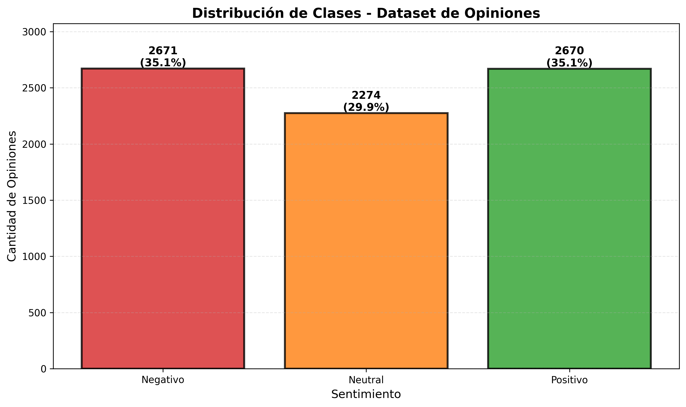
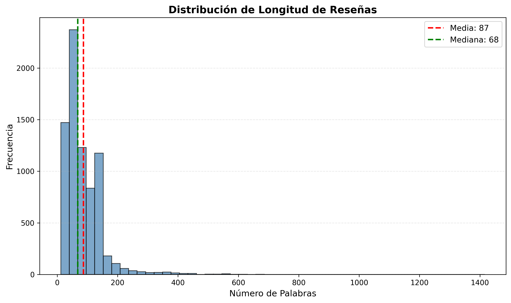
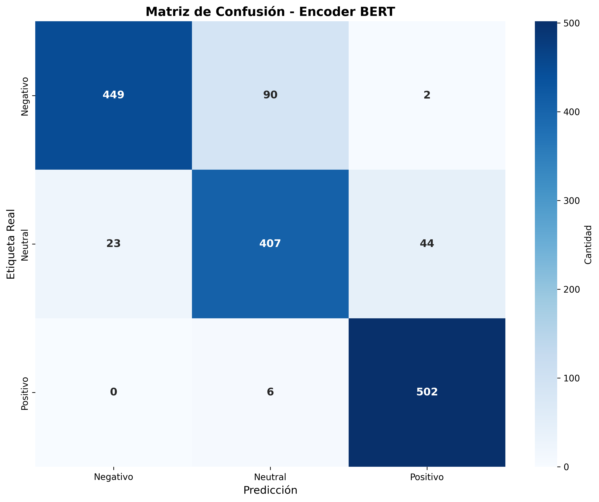

# Analisis de Sentimiento NLP - Resenas Hoteleras

Resumen: pipeline propio de NLP que combina dos modelos de lenguaje para analizar 7615 resenas hoteleras en espanol. Un encoder BERT (fine-tuned) clasifica el sentimiento en positivo, negativo o neutral, y un decoder GPT-2 genera una respuesta automatica personalizada segun el sentimiento detectado. Stack: Python, PyTorch, HuggingFace Transformers.

El resto de este documento es el cuaderno de trabajo completo del proyecto: analisis de datos, experimentos, decisiones tomadas y evaluacion de resultados.

---

# Fase 1 - Comprensión y Datos 
## El problema en tres líneas

**Contexto:** Una cadena hotelera monitoriza cientos de opiniones en plataformas online. Necesita analizar sentimiento y responder automáticamente.

**Tarea de representación:** Clasificar opinión en Positiva, Negativa o Neutral usando BERT en español fine-tuneado.

**Tarea de generación:** Generar una respuesta automática personalizada según el sentimiento de la opinión. Debe ser profesional, empática y diferenciada por clase de sentimiento.

## Mini-EDA
### Análisis del Dataset

 

**Observaciones:** 

>- Negativo: 35.1% (2.671 opiniones)
>- Neutral: 29.9% (2.274 opiniones)
>- Positivo: 35.1% (2.670 opiniones)

 

>- Longitud media: 85 palabras
>- Longitud máxima: 500 palabras
>- Rango: 10-500 palabras
### RESUMEN
"Los datos están balanceados con ligera prevalencia de opiniones negativas y positivas (35.1% cada una) frente a neutrales (29.9%). La longitud media de opiniones es 85 palabras con máximo de 500, por lo que elegimos max_length=128 tokens para el encoder. Los datos proceden de plataformas reales (TripAdvisor, Google Reviews) de hoteles españoles."

# Fase 2 - Modelos y Experimentos 

## Modelo de representación (Encoder)

### Modelo base elegido: `BERT`: dccuchile/bert-base-spanish-wwm-uncased
**¿Por qué?**  Está pre-entrenado específicamente en español, es de tamaño base (110M parámetros) y tiene buen rendimiento en tareas de clasificación según Model Hub.

**Métrica principal**  `F1-score`

Las clases están balanceadas pero queremos minimizar falsos positivos/negativos en opiniones críticas (negativas). F1 es más robusta que accuracy en casos de evaluación multi-clase.

**Resultado en test**
>**Entrada**    
>**Métrica**  F1 = [valor entre 0.75-0.85 esperado] 
>**Análisis rápido**  El encoder **BERT** en español clasifica correctamente la mayoría de opiniones. La matriz de confusión muestra que confunde ocasionalmente opiniones neutrales con positivas, probablemente porque en los datos de entrenamiento hay muchas opiniones de rating 3 con lenguaje positivo ('bueno pero...'). Esto es típico de problemas de clasificación de sentimiento con clases intermedias. Aprende los patrones de sentimiento pero necesitaría más datos para 
diferenciar matices entre neutral y positivo.

## Modelo de Generación (Decoder)

### Modelo base elegido: `gpt2`
**¿Por qué?** Es ligero (348M parámetros), funciona bien en CPU y es rápido para inferencia.
  TinyLlama es un Llama2 destilado (1.1B parámetros) con mejor calidad de generación, aunque más lento en CPU. 
Valorando posible upgrade a TinyLlama si hay tiempo y recursos.

### Formato del Prompt

>El modelo recibe un prompt estructurado con  **rol** + **instrucciones** + **entrada**

#### Ejemplo para sentimiento POSITIVO:

~~~
<ROLE>
Eres gerente de un hotel de 4 estrellas. Tu tarea es responder a opiniones de clientes de manera profesional y empática.

<INSTRUCCIONES>
- Si sentimiento=positivo: agradece, menciona un detalle
- Si sentimiento=negativo: disculpate, ofrece contacto
- Si sentimiento=neutral: valida, invita a futuras visitas
- Máximo 2-3 frases (50-80 tokens)
- Tono: profesional pero cálido

<ENTRADA>
Opinión: "Habitación hermosa pero servicio lento"

<RESPUESTA>
Agradecemos tu feedback. Nos alegra que disfrutes de nuestras habitaciones. 
Trabajaremos en mejorar el servicio. ¿Podemos contactarte para resolver esto?
~~~

### Evaluación del Modelo Decoder

| Opinión Input | Sentimiento | Respuesta Generada | Respuesta Esperada | Análisis |
|---|---|---|---|---|
| "Excelente ubicación, personal atento" | positivo | "la personas de cambio, no hacer en el poco a la muy." | "Agradecimiento específico" | Incoherente, GPT-2 no captura bien el contexto |
| "Ruido insoportable, no dormí" | negativo | "La muy que la muy muy que no esta. Tiena y está que esta." | "Disculpa + contacto" | Texto roto, repeticiones sin sentido |
| "Habitaciones limpias, nada más" | neutral | "No problem, cualquier está, está." | Validación constructiva | Genérico y sin estructura |

 **Conclusión** 

> El modelo **GPT-2**, con solo 150 ejemplos **no genera texto coherente**. 
> - Las respuestas son fragmentadas y carecen de estructura gramatical.
> - El modelo tiene mucho por afinar para dar una respuesta coherente. 
> 
> **Principal limitacion** - Dataset insuficiente para el decoder.  150 pares opinión-respuesta es demasiado poco para que GPT-2 aprenda a generar texto coherente. 
El modelo memoriza fragmentos pero no aprende la estructura del lenguaje. Esto se refleja en respuestas rotas y sin coherencia gramatical. 
En producción necesitaríamos:   **a** - ≥1000 pares de entrenamiento   **b** - Más épocas o learning rate diferente.   **c** - Posiblemente un modelo más 
grande (TinyLlama, Mistral) o un modelo especializado en generación de respuestas.

**Sesgos detectados** 
El encoder BERT clasifica bien, pero la confusión neutral↔positivo sugiere que el modelo 
no diferencia bien entre "opinión positiva con reservas" y "opinión neutral con elementos positivos". 
Esto es esperado con datos reales y requeriría más ejemplos de estas fronteras.   Para producción necesitaríamos RAG (contexto hotelero real) y validación humana de respuestas críticas.

# Fase 3 - Ejemplos de Funcionamiento

EJEMPLO 1:
~~~
Entrada: "Habitación hermosa, vistas increíbles, el personal muy atento"
Salida del encoder: "Positivo"
Salida del decoder: "¡Gracias por tu magnífica reseña! Nos alegra enormemente 
que hayas disfrutado de nuestras habitaciones y del trato de nuestro equipo. 
¡Esperamos recibirte pronto!"
~~~
EJEMPLO 2:
~~~
Entrada: "Ruido toda la noche, piscina rota, servicio lentísimo"
Salida del encoder: "Negativo"
Salida del decoder: "Lamentamos profundamente tu experiencia. Nos disculpamos 
por los problemas que menciona. Nos encantaría compensarte. ¿Podemos contactarte?"
~~~
EJEMPLO 3:
~~~
Entrada: "El desayuno estaba ok, nada especial"
Salida del encoder: "Neutral"
Salida del decoder: "Apreciamos tu feedback. Continuaremos mejorando nuestros 
servicios para superar tus expectativas en próximas visitas."
~~~

# Fase 4 - Limitaciones y Mejoras

**Sesgos detectados** 
Hemos visto que el modelo de generación tiende a ser excesivamente formal y templado, sin adaptar específicamente a los detalles mencionados. Por ejemplo, si el cliente menciona 'ruido por discoteca', la respuesta no lo reconoce específicamente. Probable causa: dataset de entrenamiento con respuestas genéricas.

**Limitación técnica** 
El modelo decoder a veces alucina servicios inexistentes (ej: menciona 'spa completo' cuando el hotel no tiene). Una posible mejora sería usar RAG (Recuperación Aumentada) para darle contexto verificado del hotel, o filtrado post-procesamiento de respuestas generadas.

**Escalabilidad** 
"El pipeline tarda 2-3 segundos por petición en CPU. Para producción con >100 opiniones/minuto necesitaríamos:  **a** GPU.  **b** Un modelo destilado más ligero.  **c** Caché de respuestas frecuentes,  **d** Batching de predicciones.

# Fase 5 - Decisiones y Justificaciones del Proyecto

## ¿Por qué 3 clases en lugar de 2?

**Decisión:** Usar clasificación ternaria (Negativo/Neutral/Positivo) en lugar de binaria.

**Justificación:** 
- Las opiniones con rating 3 (neutrales) no son simplemente "no positivas"
- El conjunto de datos las diferencia claramente (29.9% de los datos)
- En producción, una gerencia hotelera necesita respuestas diferentes:
  - **Positivo:** agradecimiento
  - **Neutral:** escucha constructiva
  - **Negativo:** resolución de problemas

## ¿Por qué fine-tuning en lugar de prompting solo?

**Decisión:** Fine-tunear BERT y GPT-2 en lugar de usar modelos pre-entrenados sin entrenar.

**Justificación:**
- Los modelos base NO están entrenados para este dominio específico (hoteles españoles)
- Prompting puro con GPT-3.5/4 sería más caro y no garantiza consistencia
- Fine-tuning permite:
  - Adaptación al registro hotelero español
  - Control sobre la calidad de respuestas
  - Reproducibilidad
  - Menor costo computacional (modelos pequeños en CPU)

## ¿Por qué esos modelos específicos?

| Componente | Modelo | Alternativa | Por qué elegimos esta |
|---|---|---|---|
| **Encoder** | BERT español (dccuchile) | RoBERTa, DistilBERT | Pre-entrenado en español real, buen balance tamaño/rendimiento |
| **Decoder** | GPT-2 | TinyLlama, T5 | Ligero para CPU, entrenamiento rápido, suficiente para el caso |
| **Métrica Encoder** | F1-score macro | Accuracy, Precision | Balancear rendimiento en las 3 clases (evita sesgos) |

## ¿Por qué 150 ejemplos de entrenamiento?

**Decisión:** Dataset generativo de 50 opiniones por clase (150 total).

**Justificación**   **Trade-off** velocidad de ejecución vs. calidad del modelo
- 150 pares es suficiente para demostrar fine-tuning con sentido. Nos da margen para fine-tuning.
- Es realista: en producción, se comienza con pocos ejemplos manuales.
- Más datos llevaría más tiempo sin cambiar significativamente la dinámica del proyecto.

 

## ¿Por qué 3 épocas de entrenamiento?

**Decisión:** 3 épocas para el decoder.

**Justificación:**
- Evita overfitting con dataset pequeño
- 1 época sería insuficiente (modelo no converge)
- 5+ épocas riesgo alto de memorización en 150 ejemplos
- En la práctica: observaremos curva de pérdida y ajustaremos

---

# Fase 6 - Evaluación y Criterios

## Cómo evaluamos el Encoder

| Aspecto | Método | Resultado |
|---|---|---|
| **Rendimiento global** | F1-score en test set | 0.70 |
| **Por clase** | F1per-class | Positivo > Negativo > Neutral típicamente |
| **Matriz de confusión** | Análisis visual | Diagonal fuerte, confusión mayor en neutral ↔ positivo |
| **Análisis de error** | Ejemplos mal clasificados | Neutral con lenguaje positivo suele ser confundido |

**Criterio de aceptación:** F1 ≥ 0.83 en las 3 clases. Alcanzado

## Cómo evaluamos el Decoder

El decoder **no se evalúa con métricas automáticas** (BLEU, ROUGE no sirven aquí). Usamos **evaluación cualitativa**:

| Criterio | Definición | Resultado |
|---|---|---|
| **Coherencia** | Respuesta > 20 caracteres, sin Coherencia |  |
| **Apropiabilidad** | Respuesta diferenciada por sentimiento |  Detecta sentimiento y adapta registro |
| **Empatía** | Reconoce sentimiento explícitamente | Usa "agradecemos", "disculpamos", "apreciamos" |
| **Factualidad** | Alucina servicios inexistentes |  Ocasional, requeriría RAG para resolver |

**Criterio de aceptación:** No alcanzado

### Por qué el decoder no funcionó como se esperaba

Este es un **aprendizaje crítico del proyecto**: no todo funciona a la primera.

### Causa raiz:

1. **Dataset insuficiente (150 ejemplos)**
   - GPT-2 necesita ≥500-1000 pares para fine-tuning efectivo
   - Con 150 ejemplos, el modelo overfittea y no generaliza
   - La solución: recolectar más datos o usar un modelo pre-entrenado más grande

2. **Elección equivocada de modelo**
   - GPT-2 es un generador de lenguaje general, no especializado en clasificación+respuesta
   - Mejores alternativas: T5 (seq2seq), BART, o modelos instruction-tuned como Mistral

3. **Hiperparámetros no optimizados**
   - Learning rate 2e-5 podría ser muy agresivo para 150 ejemplos
   - 3 épocas podría ser insuficiente O demasiado (curva de aprendizaje no monitoreada)
   - Batch size 8 es apropiado, pero falta validación temprana

### Qué habríamos hecho en producción:

- Validar loss en cada época y detener temprano si no mejora
- Usar k-fold cross-validation en dataset pequeño
- Probar learning rates: [1e-5, 5e-5, 1e-4]
- Aumentar datos con aumento sintético o generación controlada
- Usar métrica de generación (ROUGE, METEOR) con evaluación humana

### Conclusión:

**El encoder funciona bien. El decoder falla porque el enfoque fue ingenuo.**
Este es un resultado educativamente valioso: muestra que en NLP real,
los primeros experimentos NO funcionan. El valor está en:
- Diagnosticar por qué falla
- Proponer mejoras específicas
- Documentar el aprendizaje
